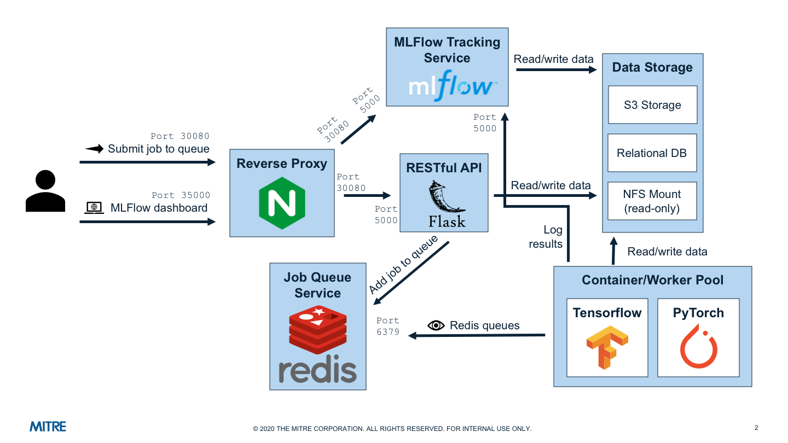

# Tensorflow MNIST Classifier demo



This demo provides a practical example that shows how the Securing AI Lab Architecture can be used to run a simple experiment on the transferability of the fast gradient method (FGM) evasion attack between two neural network architectures.
It can be used as a basic template for crafting your own custom scripts to run within the architecture.

## Getting started

The step-by-step demo is provided in the Jupyter notebook format in the file `demo.ipynb`.
The easiest way to get up and running with the Jupyter notebook is to install a recent version of Anaconda on your host machine.
Links for installing version 2020.07 are provided below,

-   Anaconda for Windows: <https://repo.anaconda.com/archive/Anaconda3-2020.07-Windows-x86_64.exe>

-   Anaconda for Mac: <https://repo.anaconda.com/archive/Anaconda3-2020.07-MacOSX-x86_64.pkg>

-   Anaconda for Linux: <https://repo.anaconda.com/archive/Anaconda3-2020.07-Linux-x86_64.sh>

After installing Anaconda, use the `environment.yml` file distributed with this example to set up a virtual environment that can be used to run the notebook and also execute the code under the `src/` directory if you want to try it out locally.
To create the virtual environment and install the necessary dependencies, run

```bash
conda env create --file environment.yml
```

To activate the environment, run,

```bash
conda activate tensorflow-mnist-classifier
```

To start up Jupyter Lab, which you can use to view and execute the Jupyter notebook, run,

```bash
jupyter lab
```

Please note, if this is your first time using this demo, then you will need to initialize the database and prepare your `docker-compose.yml` file.
Initializing the database can be done using the `Makefile`,

```bash
make initdb
```

To prepare your `docker-compose.yml`, select one of the following three files distributed with the demo that best matches your computing platform,

-   `docker-compose.win.yml` - Best suited for Windows computers (as well as personal Linux installations)
-   `docker-compose.macos.yml` - Best suited for MacOS, but you need to enable NFS functionality for this to work, otherwise default to the `win` file

Then, make a copy of it as follows,

```bash
# This assumes you have a Windows computer
cp docker-compose.win.yml docker-compose.yml
```

You should now be able to start running the demo provied in the Jupyter notebook.

### NFS on MacOS

To enable the use of NFS volumes with Docker on the Mac, you will need to do the following.
First, open the NFS exports file with administrator privileges: `sudo nano /etc/exports`.
The file will likely be empty.
Add this line and save:

    /System/Volumes/Data -alldirs -mapall=501:20 localhost

Next, open the NFS config file with administrator privileges: `sudo nano /etc/nfs.conf`.
The file again will likely be empty.
Add this line and save:

    nfs.server.mount.require_resv_port = 0

Afterwards, restart the nfsd service,

    sudo nfsd restart

You should now be able to use the `docker-compose.macos.yml` file without error.
